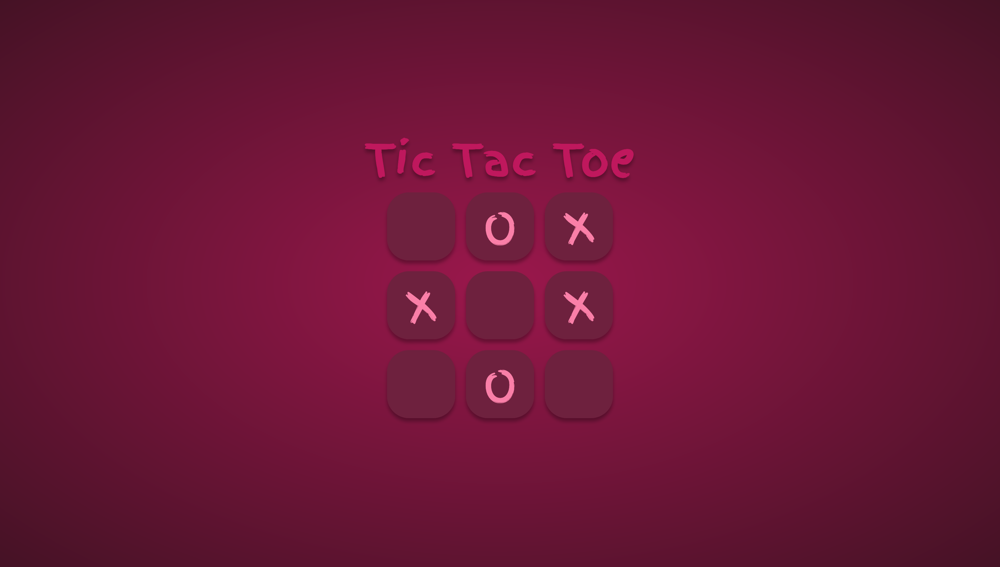

# Tic Tac Toe

<p align="center">
  <a href="#overview">Overview</a> •
  <a href="#what-i-learned">What I learned</a> •
  <a href="#useful-resources">Useful Resources</a> •
  <a href="#contact">Contact</a>
</p>

## Overview 

The purpose of this project was to make a browser version of the classic Tic Tac Toe game using module pattern and factory pattern to limit the amount of global code. Current version offers only Human vs Human play.

### Outcomes

- Used HTML5 **semantic elements** for better readability and structure
- Used CSS3 **grid** and **flex** to manage layout
- Used **Git** and **GitHub** for project management
- **Cross tested** on Firefox, Webkit, and  Chromium based browsers
- Responsive for both Desktop & Mobile 

### Things to Improve

- Get **Player Name**
- Add **AI Logic** for Player vs Computer.
- Add **Hover Effect** to show current player mark before placing on grid.

### Desktop Preview



### Live Version

[Tic Tac Toe](https://ryanthayes.github.io/tic-tac-toe/)

### Built With

       


## What I learned

- Better understanding of variable scoping.
- Using IIFE Module Patterns

```js
const setBoard = (() => {
    
    const renderBoard = () => {
        allCells.forEach((cell, index) => {
            cell.setAttribute('data-index', index);
            cell.addEventListener('click', () => {
                playRound.placeMark(index);
            })
        }) 
    };

    const resetBoard = () => {
        board = [
            ['', '', ''],
            ['', '', ''],
            ['', '', '']
        ];
        currentPlayer = playerOne;
        gameOver = false;
        allCells.forEach(cell => {
            cell.innerText = '';
        });
        endGameInfo.innerHTML = '';
    };
    
    return {
        renderBoard,
        resetBoard
    };

})();
```
- That **HTML Dialog** will stay open if **Display Flex** is used on the dialog element. Need to add **[open] to CSS**

```CSS
.end-game__modal[open] { /* [open] req when display: flex */
  top: 50%;
  left: 50%;
  translate: -50% -50%;
  width: 350px;
  height: 200px;
  display: flex;
  flex-direction: column;
  justify-content: center;
  gap: var(--spacing-sm);
  padding: var(--spacing-md);
  background-color: var(--primary-800);
  border: 0;
  border-radius: var(--br-md);
  box-shadow: var(--shadow);
}
```
## Proud Of

Keeping most of the code inside of **Module Patterns**. Though, I do still have DOM selectors and global variables as part of global scope. I am sure this can be approved upon.

## Contact

[](https://www.linkedin.com/in/ryan-t-hayes/)
